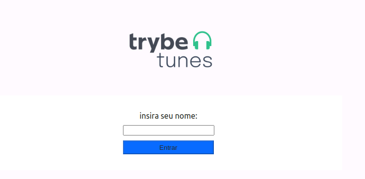
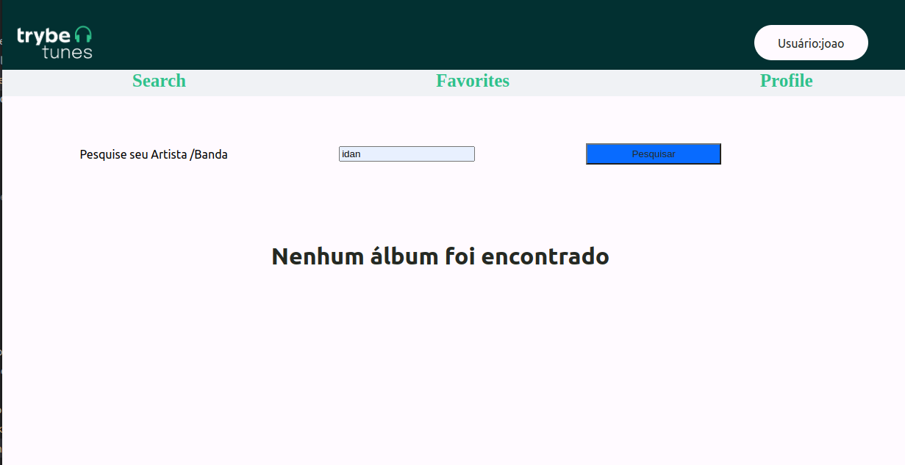
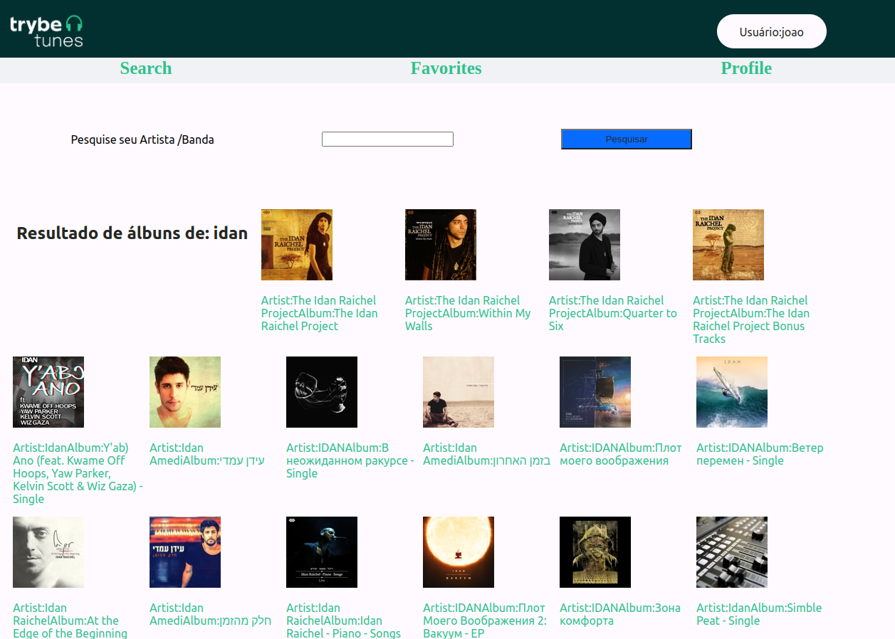
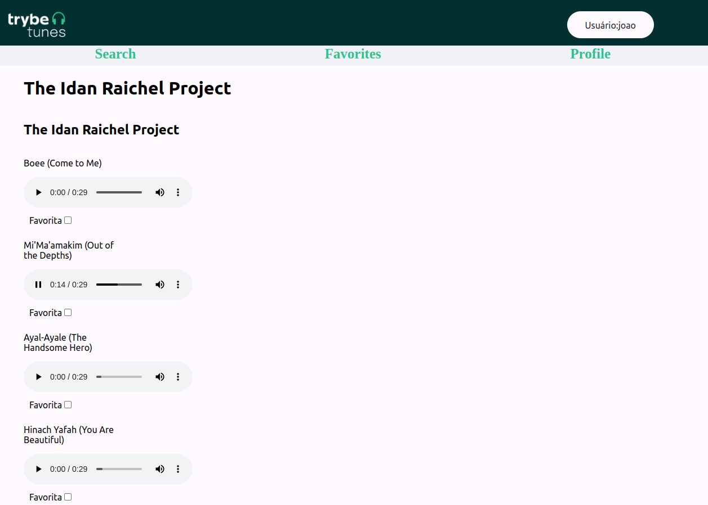
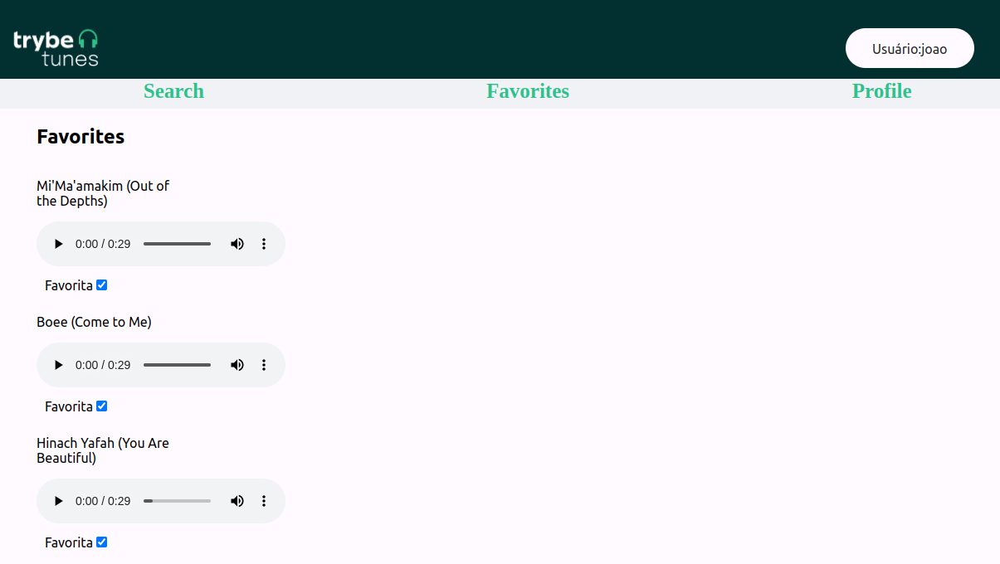
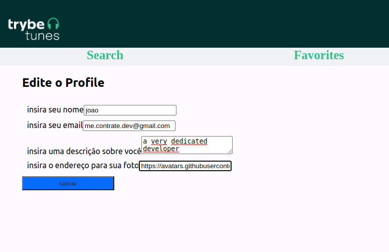
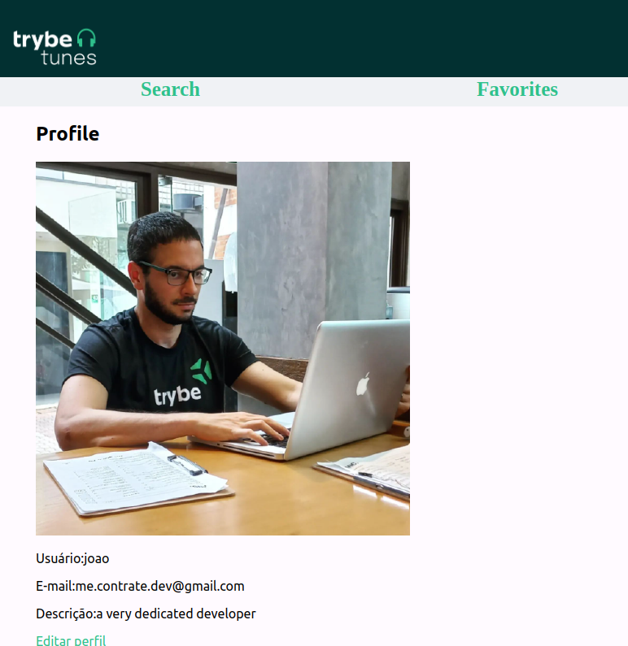

# FindTunes 

A front-end React interface to find and listen to your music, using Itunes API to browser songs and the possibility to save them as your favorite.

The files enlisted in this repository were fully developed by @Jvieyrah and to run them in your machine make sure you have the latest version of Node JS installed at your machine, alongside with react and redux.

Before start - enter the clonned repository and instal it's the dependencies by typing on your terminal: npm install
once installed typy 'npm start' at your terminal to run it on your browser.

Insert your name to start  account.

The feel free to browse even the most exotic and unknwn artits, this interface connects with with itunes API to make sure you find the music that you really want to hear. 

(in my case i wanted to hear a not so famous israeli singuer Idan Raichel)

You can hear every song from the selected album and favorite the ones you like.

You even can edit your personal profile, to make it more personal.

